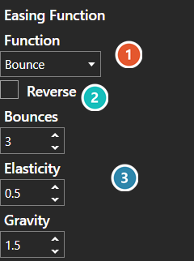

# Easing Function Editor

*Источник: https://docs.rpg-architect.com/04-editor/easing-function-editor/*

---

# Easing Function Editor

## **Easing Function Editor**[¶](#easing-function-editor "Permanent link")

The Easing Function Editor is where the rate of a change over time is chosen — whether a movement runs evenly, starts slowly and gathers pace, or overshoots and settles back.

Function selects the curve. Linear applies no shaping at all and takes no further settings; the others expose parameters that control how pronounced the effect is. Reverse mirrors the curve so it applies from the opposite end.

The values an easing function holds are documented under [Easing Function](../../05-reference/easing-function/).

###  Function[¶](#function "Permanent link")

Which curve is applied. Linear applies no shaping at all and takes no further settings; the others each expose their own.

###  Reverse[¶](#reverse "Permanent link")

Mirrors the curve so it applies from the opposite end - an ease-in becomes an ease-out.

###  Parameters[¶](#parameters "Permanent link")

**These belong to the chosen function** and are replaced when it changes - Bounces, Elasticity and Gravity are Bounce's. Linear and Instant have none, which is why the panel looks empty on them.