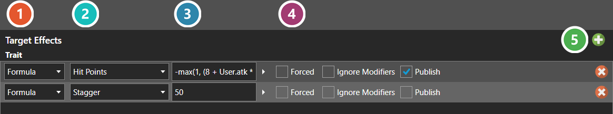

# Effect Table Editor

*Источник: https://docs.rpg-architect.com/04-editor/effect-table-editor/*

---

# Effect Table Editor

## **Effect Table Editor**[¶](#effect-table-editor "Permanent link")

An effect table is a list of things that happen to a battler — damage and healing, status effects applied or removed, statistics modified, global switches and variables set. It is the same editor wherever effects are authored — [Skills](../../06-database/01-skills/01-skills/), [Items](../../06-database/02-items/01-items/), and [Status Effects](../../06-database/05-statistics/03-status-effects/).

Each row is one effect, and the first column chooses what kind it is — a statistic change, a status effect, a formula, a skill, an equipment or item or skill type, a physical property, a tile tag, an elemental, a battle counter, or a global switch or variable. **The rest of the row changes to match that choice**, because each kind needs different values: a statistic effect asks which statistic and by how much, a state effect asks which status to apply or remove, a global switch effect asks which switch and whether to set or clear it. So the row is not a fixed set of fields — it reshapes itself around the kind.

**Forced** makes the effect land regardless of resistances, **Ignore Modifiers** skips the target's usual reductions, and **Publish** shows the result in the battle log.

Which kinds of effect a table offers depends on where it appears, because not every effect makes sense in every place. Ongoing effect tables add an **Occurrence** column, which is what makes an effect repeat — every step, every second, every turn or round, or after each battle — rather than firing once.

The values a row holds are documented under [Trait Effect Table](../../05-reference/trait-effect-table/).

###  Effect Kind[¶](#effect-kind "Permanent link")

What sort of effect the row is - a statistic change, a status effect, a formula, a global switch or variable, and so on. **Changing it changes the columns to its right**, because each kind needs different values: a statistic effect asks which statistic and by how much, a state effect asks which status to apply or remove.

###  Target[¶](#target "Permanent link")

What the effect acts against.

###  Value[¶](#value "Permanent link")

How much it changes by. A formula can reference the user and the target, so damage can scale with the attacker's statistics. The arrow expands it into a larger editor.

###  Flags[¶](#flags "Permanent link")

**Forced** lands the effect regardless of resistance, **Ignore Modifiers** skips the target's usual reductions, and **Publish** shows the result in the battle log.

###  Add Effect[¶](#add-effect "Permanent link")

Adds a row. Which kinds are offered depends on where the table appears - an Ongoing table on a status effect also gets an Occurrence column, which is what makes an effect repeat rather than fire once.