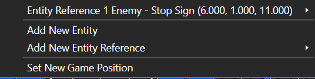
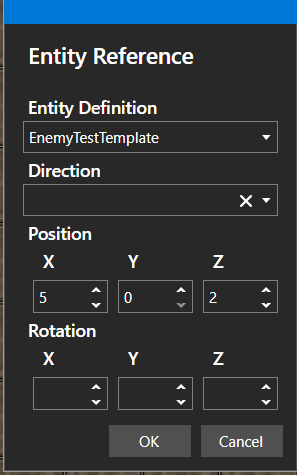

# Entity Reference

*Источник: https://docs.rpg-architect.com/04-editor/map-editor/entity-reference/*

---

# Entity Reference

## **Entity Reference**[¶](#entity-reference "Permanent link")

Entity References are created by placing [Entity Definitions](../../../06-database/03-maps/04-entity-definitions/) on the map. While the map editor is in [Entity](../../../05-reference/entity/) mode, right click a tile to bring up a drop down menu. Select Add Entity Reference and you will then select your Entity Reference from the list of your Entity Definitions.  This creates an Entity Reference on the Map. Each Entity Reference is listed in the Tools section of the map editor.

Once an Entity Definition is an Entity Reference on the Map, you can convert into a standard Entity and edit it as you would any other Entity.

Double clicking the Entity Reference in the Map Editor will bring up an Entity Reference menu.

## **Properties**[¶](#properties "Permanent link")

#### **Entity Reference**[¶](#entity-reference_1 "Permanent link")

Name

Explanation

Type

Direction

The direction the Entity Reference is facing

Entity Definition

The Entity Definition being referenced

Position

The x, y, and z co-ordinates for where the Entity Reference is located on the Map.

Rotation

The x, y, and z co-ordinates for the rotation of the Entity Reference on the Map.