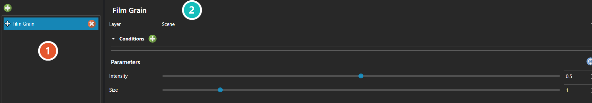

# Graphics Post Processor Editor

*Источник: https://docs.rpg-architect.com/04-editor/graphics-post-processor-editor/*

---

# Graphics Post Processor Editor

## **Graphics Post Processor Editor**[¶](#graphics-post-processor-editor "Permanent link")

The Graphics Post Processor Editor is where effects applied to the finished frame are assembled — the pass that runs after the scene has been drawn.

Effects are held as a list and applied in the order they appear, so re-ordering them changes the result: a blur placed before a colour grade produces something different from the same two reversed. Each effect exposes its own parameters, and a [Condition](../../05-reference/condition/) can decide whether it runs at all.

The effects available, and the parameters each one takes, are documented under [Graphics Post Processors](../../05-reference/graphics-post-processor/).

###  Effects[¶](#effects "Permanent link")

Every effect applied to this scene, in the order they run. Re-ordering the list changes the result, since each effect works on the frame the one above it produced.

###  Effect Settings[¶](#effect-settings "Permanent link")

Configures whichever effect is selected: the layer it draws over, the conditions that decide whether it runs at all, and the parameters that effect exposes. The effects available and their parameters are listed under [Graphics Post Processors](../../05-reference/graphics-post-processor/).