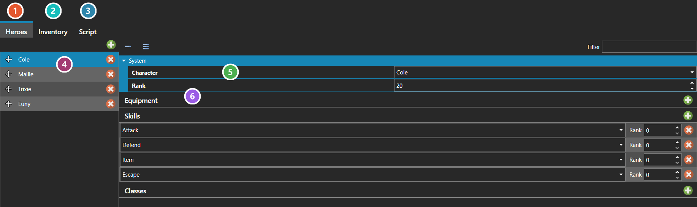

# Party Editor

*Источник: https://docs.rpg-architect.com/04-editor/party-editor/*

---

# Party Editor

## **Party Editor**[¶](#party-editor "Permanent link")

The Party Editor is where a party is assembled — who is in it, what they are carrying, and what they already know how to do. It is the same editor in both places it appears: [New Game](../../06-database/10-system/21-new-game/), where it defines the party the game begins with, and the **Battle Test** tab on [Enemy Formations](../../06-database/06-enemies/01-enemy-formations/), where it defines the party a test battle is fought with.

**Heroes** lists the party in order, and that order is the party order — drag a hero by its handle to change it. Each hero is a [Character](../../06-database/00-characters/00-characters/) at a chosen Rank, and selecting one opens three further lists: **Equipment**, which pairs an [Equipment Slot](../../06-database/02-items/10-equipment-slots/) with the equipment placed in it and the rank that equipment is at; **Skills**; and **Classes**. Each is granted at a rank of its own, so a hero can start already equipped, already taught, and already classed rather than being built up in script.

**Inventory** is what the party starts holding. Each row is an item or a piece of equipment — the Is Equipment toggle decides which — with a quantity, and a rank for equipment. **Include All Items** grants one of everything in the database instead, which is a testing convenience rather than something to ship with.

**Script** runs once after the party has been built, for anything the lists cannot express.

###  Heroes[¶](#heroes "Permanent link")

The party itself, in order.

###  Inventory[¶](#inventory "Permanent link")

What the party is carrying to begin with - items and equipment, each with a quantity. **Include All Items** grants one of everything in the database instead, which is a testing convenience rather than something to ship with.

###  Script[¶](#script "Permanent link")

Runs once after the party has been built, for anything the lists cannot express - see [Script Editor](../script-editor/).

###  Members[¶](#members "Permanent link")

**The list order is the party order.** Drag a hero by the handle at the left of its row to change it. Selecting a hero opens its details to the right.

###  Character and Rank[¶](#character-and-rank "Permanent link")

Which [Character](../../06-database/00-characters/00-characters/) this party member is, and the rank it starts at. Everything else on the hero is layered on top of that character.

###  Equipment, Skills and Classes[¶](#equipment-skills-and-classes "Permanent link")

Three lists, each pairing a thing with the rank it is granted at - so a hero can begin already equipped, already taught, and already classed rather than being built up in script. Equipment also names the [Equipment Slot](../../06-database/02-items/10-equipment-slots/) it goes into.

> **Note**: The party on Enemy Formations' Battle Test tab is stored with the project rather than in the database. It exists to fight the formation being edited and never reaches the game.