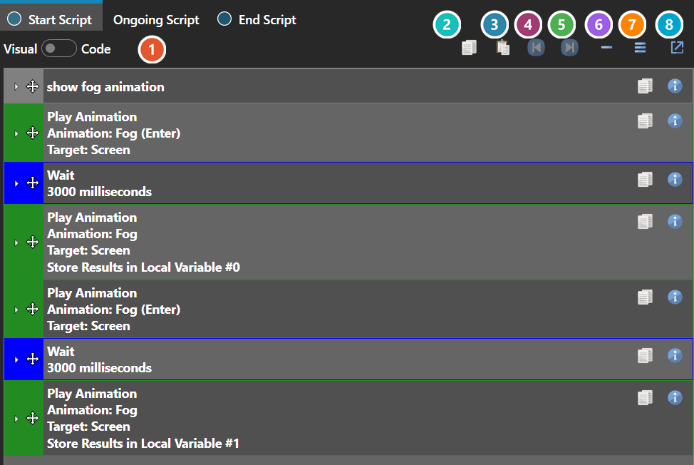
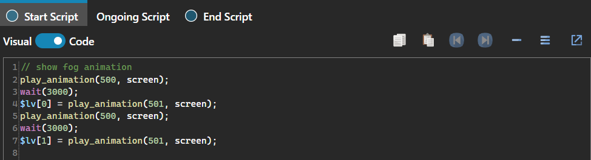

# Script Editor

*Источник: https://docs.rpg-architect.com/04-editor/script-editor/*

---

# Script Editor

## **Script Editor**[¶](#script-editor "Permanent link")

The Script Editor is where every script in the project is written: a stack of commands run in order, each configured through its own dialog.

Scripts are authored visually by default. The Visual / Code toggle presents the same script as text instead, changing how it is written and stored rather than what it does.

What the individual commands do is documented under [Commands](../../07-commands/).

###  Visual and Code[¶](#visual-and-code "Permanent link")

Switches between the command stack and the same script written as text. Visual is the default.

###  Copy[¶](#copy "Permanent link")

Copies the entire script to the clipboard.

###  Paste[¶](#paste "Permanent link")

Replaces the script with one from the clipboard.

###  Undo[¶](#undo "Permanent link")

Steps back through edits made to this script.

###  Redo[¶](#redo "Permanent link")

Steps forward again.

###  Collapse All[¶](#collapse-all "Permanent link")

Folds every command down to a single line.

###  Expand All[¶](#expand-all "Permanent link")

Opens every command out again.

###  Pop Out[¶](#pop-out "Permanent link")

Opens the script in its own window, which is worth doing on a long script — the embedded panel is only as tall as the section hosting it.

> **Note**: In Code view, undo and redo are handled by the text editor itself rather than the script editor, so Ctrl+Z and Ctrl+Y behave as they would in any text box.