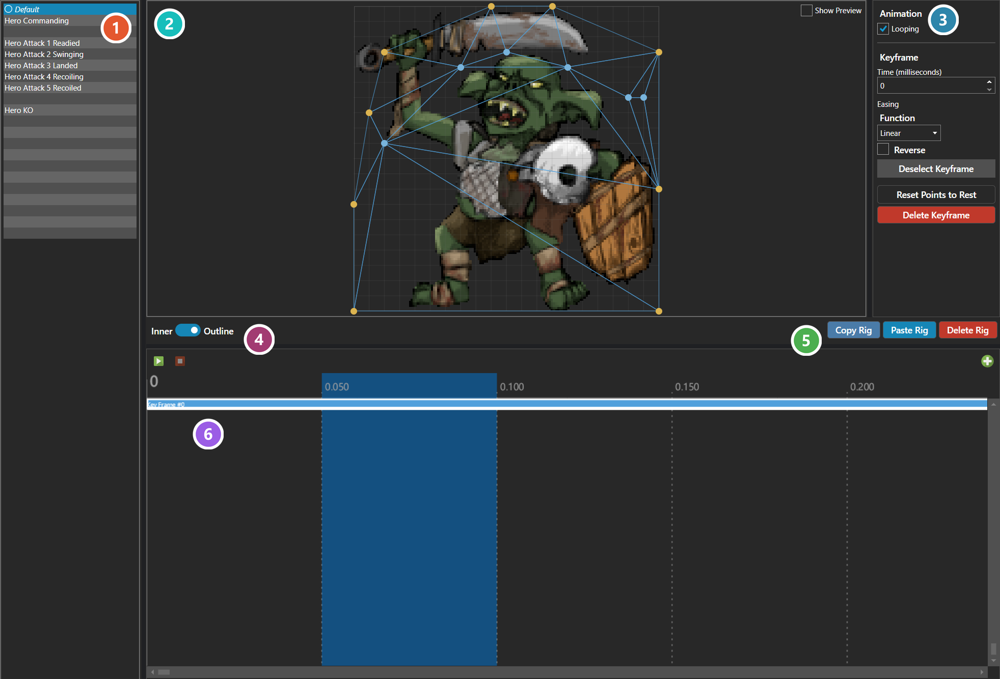

# Sprite Rigging Editor

*Источник: https://docs.rpg-architect.com/04-editor/sprite-rigging-editor/*

---

# Sprite Rigging Editor

## **Sprite Rigging Editor**[¶](#sprite-rigging-editor "Permanent link")

The Sprite Rigging Editor is where a sprite is given a deformable mesh so it can bend, stretch, and squash — motion its own frames cannot produce. It is reached from the **Sprite Rigging** tab on an [Enemy](../../06-database/06-enemies/00-enemies/).

The list on the left is one entry per [Battle Pose](../../06-database/07-battles/10-battle-poses/), plus a default entry shown in italics that plays whenever no pose-specific animation exists. Entries that already have an animation are marked; selecting one that does not offers **Create Animation**.

The canvas is where the mesh is built. Left-click empty space to add a control point, drag a point to move it, and right-click a point to remove it. The **Inner / Outline** toggle decides which kind a new point becomes: outline points form the silhouette the mesh is clipped to, inner points let the interior deform. Both belong to the rig rather than to any one animation.

The timeline holds the keyframes. With no keyframe selected the canvas edits the **rest pose** — the shape the sprite sits in, and the shape every keyframe is measured against. Selecting a keyframe switches to editing that keyframe's own snapshot of the points, and while one is selected points can be moved but not added or removed. Each keyframe carries a time and an [Easing Function](../easing-function-editor/) shaping the blend _into_ it from the keyframe before, and **Looping** decides whether the animation restarts at the last keyframe or holds there.

**Show Preview** replaces editing with playback, drawing the deformation interpolated at the timeline position — the only way to judge whether the motion reads. **Copy Rig**, **Paste Rig**, and **Delete Rig** act on the whole rig, mesh and every pose together.

The values a rig holds are documented under [Sprite Rig](../../05-reference/sprite-rig/).

###  Poses[¶](#poses "Permanent link")

One entry per [Battle Pose](../../06-database/07-battles/10-battle-poses/), plus a **Default** entry in italics that plays whenever the active pose has no animation of its own. Entries that already have one are marked; selecting an entry that does not offers **Create Animation**.

###  Canvas[¶](#canvas "Permanent link")

Where the mesh is built over the sprite. Left-click empty space to add a control point, drag a point to move it, and right-click a point to remove it.

###  Animation and Keyframe[¶](#animation-and-keyframe "Permanent link")

**Looping** decides whether the animation restarts at the last keyframe or holds there. Beneath it are the selected keyframe's own settings - its time, and the [Easing Function](../easing-function-editor/) shaping the blend _into_ it from the keyframe before.

###  Inner / Outline[¶](#inner-outline "Permanent link")

Which kind of point the next one added becomes. **Outline** points form the silhouette the mesh is clipped to; **Inner** points let the interior deform. Both belong to the rig rather than to any one animation, so adding or removing one changes every pose.

###  Rig Actions[¶](#rig-actions "Permanent link")

Copy, paste and delete act on **the whole rig** - the mesh and every pose together, not just the animation being edited.

###  Timeline[¶](#timeline "Permanent link")

The keyframes of the selected pose. With none selected the canvas edits the **rest pose** - the shape the sprite sits in, and the shape every keyframe is measured against. Selecting one switches to editing that keyframe's own snapshot, and points can then be moved but not added or removed.

> **Note**: Adding or deleting a control point changes every animation on the rig, because each keyframe stores one position per point and the two lists are kept parallel.