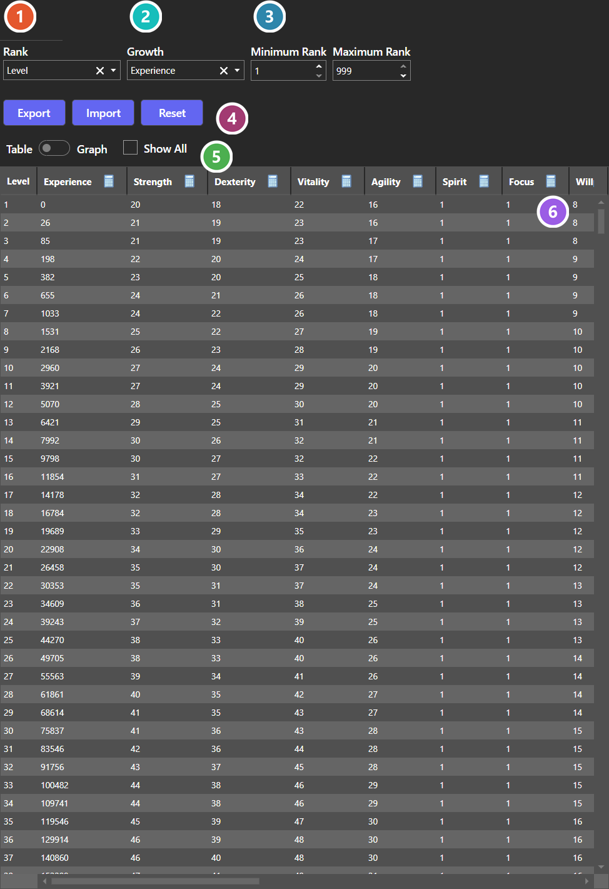
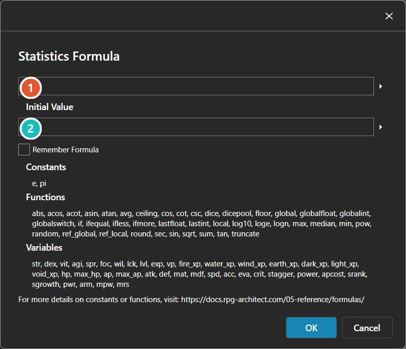
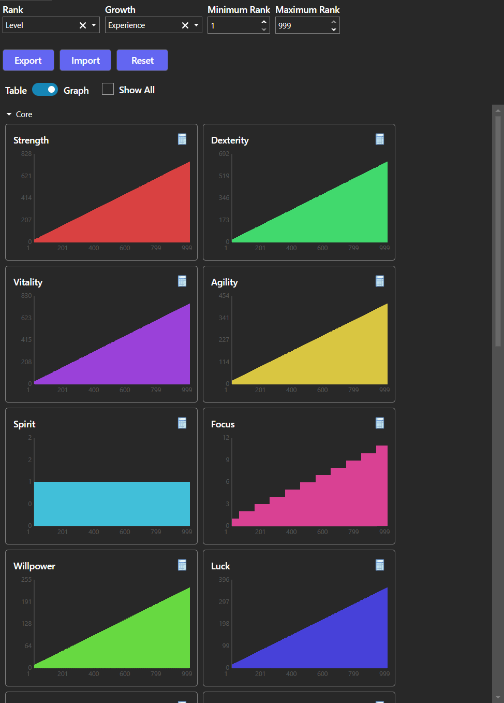
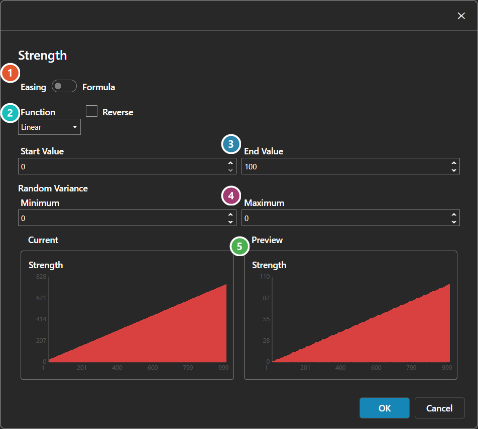

# Statistics Table Editor

*Источник: https://docs.rpg-architect.com/04-editor/statistics-table-editor/*

---

# Statistics Table Editor

## **Statistics Table Editor**[¶](#statistics-table-editor "Permanent link")

The Statistics Table Editor is where a statistic's value at every rank is authored. It is the same editor everywhere it appears — [Characters](../../06-database/00-characters/00-characters/), [Classes](../../06-database/00-characters/01-classes/), [Enemies](../../06-database/06-enemies/00-enemies/), [Equipment](../../06-database/02-items/02-equipment/), and [Skills](../../06-database/01-skills/01-skills/) all use it.

The editor works in two formats, switched with the Table / Graph toggle. **Table** lists one row per rank and is what you edit directly. **Graph** plots the same values as a curve, which is the faster way to judge whether growth accelerates or flattens where you intended.

Rank and Growth choose which statistic drives progression and which one measures it, and Minimum and Maximum Rank set how far the table extends. Export, Import, and Reset act on the whole table at once.

The values the table holds are documented under [Statistics Table](../../05-reference/statistics-table/).

###  Rank Statistic[¶](#rank-statistic "Permanent link")

The statistic that tracks the current rank - the column the table is keyed on.

###  Growth Statistic[¶](#growth-statistic "Permanent link")

The statistic that accumulates toward the next rank. In a level-based setup this is experience.

###  Rank Range[¶](#rank-range "Permanent link")

The lowest and highest rank the table covers. Widening the range adds rows; narrowing it drops them.

###  Export / Import / Reset[¶](#export-import-reset "Permanent link")

Moves the whole table in and out of a file. Tables this large are usually easier to author in a spreadsheet and import back.

###  Table / Graph[¶](#table-graph "Permanent link")

Switches between editing the raw numbers and seeing them plotted, which makes an uneven growth curve obvious at a glance.

###  Values[¶](#values "Permanent link")

One row per rank and one column per statistic in Table mode; one editable curve per statistic in Graph mode. The calculator opens a **Formula editor** from a column header in Table mode, and a **Curve editor** from a card in Graph mode. In Graph mode you can also click a point on a curve to set that rank's value directly.

###  Formula[¶](#formula "Permanent link")

The expression evaluated for every rank in the column, written in the engine's own formula syntax. The names listed under **Variables** below are the other statistics, so one column can be derived from another.

###  Initial Value[¶](#initial-value "Permanent link")

The value the first rank starts from, where the formula needs somewhere to begin. Both boxes expand into a larger editor with the arrow at their right.

## **Graph Mode**[¶](#graph-mode "Permanent link")

###  Easing / Formula[¶](#easing-formula "Permanent link")

How the curve is generated - stepped through an easing function, or evaluated from a formula.

###  Easing Function[¶](#easing-function "Permanent link")

Which easing function shapes the curve, and whether it runs in reverse. See [Easing Function Editor](../easing-function-editor/).

###  Start / End Values[¶](#start-end-values "Permanent link")

The range the curve spans - the value at the first rank and the value at the last.

###  Random Variance[¶](#random-variance "Permanent link")

How far each rank's value may drift from the curve, so growth need not be perfectly smooth.

###  Current / Preview[¶](#current-preview "Permanent link")

The values the table holds now, beside the ones these settings would produce.