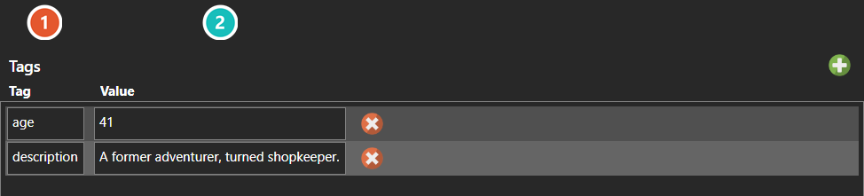

# Tag Editor

*Источник: https://docs.rpg-architect.com/04-editor/tag-editor/*

---

# Tag Editor

## **Tag Editor**[¶](#tag-editor "Permanent link")

Tags are key and value pairs attached to a database entry so other systems can match against it rather than against a specific entry. The Tag Editor is the same editor everywhere it appears — [Characters](../../06-database/00-characters/00-characters/), [Classes](../../06-database/00-characters/01-classes/), [Skills](../../06-database/01-skills/01-skills/), [Items](../../06-database/02-items/01-items/), and [Data Entries](../../06-database/04-data-entries/00-data-entries/) all use it, as do entities placed on a map.

Nothing has to be declared up front: type a key on one entry and anything matching that key will find it. The value beside it is free text, so a tag can carry data - an age, a description - as well as marking the entry. That also means spelling is load-bearing — a mistyped tag fails silently rather than reporting an error.

The field itself is documented under [Tags](../../05-reference/tags/).

###  Tag[¶](#tag "Permanent link")

The tag's key. Nothing has to be declared up front - type a key on one entry and anything matching it will find that entry. Spelling is load-bearing, because a mistyped key simply never matches.

###  Value[¶](#value "Permanent link")

The value stored against that key. **A tag is a key and a value, not a bare label**, so a tag can carry data - an age, a description - as well as marking the entry for matching.