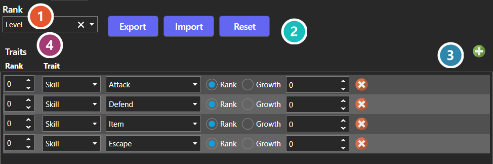

# Trait Table Editor

*Источник: https://docs.rpg-architect.com/04-editor/trait-table-editor/*

---

# Trait Table Editor

## **Trait Table Editor**[¶](#trait-table-editor "Permanent link")

Traits are the reusable building blocks that grant skills, resistances, and passive effects. The Trait Table Editor is the same editor everywhere it appears — [Characters](../../06-database/00-characters/00-characters/), [Classes](../../06-database/00-characters/01-classes/), [Enemies](../../06-database/06-enemies/00-enemies/), and [Equipment](../../06-database/02-items/02-equipment/) all use it.

Because the same editor is attached in several places, a character's effective traits are the sum of every table that applies to it at the time: its own, plus those of any class it has taken and any equipment it currently has on.

The values a trait holds are documented under [Trait Table](../../05-reference/trait-table/).

###  Rank Statistic[¶](#rank-statistic "Permanent link")

The statistic that tracks rank for this table. Each row below applies once its rank is reached in this statistic.

###  Export / Import / Reset[¶](#export-import-reset "Permanent link")

Moves the whole table in and out of a file, so a set of traits can be authored elsewhere or reused across entries. Reset clears the table back to empty.

###  Add Trait[¶](#add-trait "Permanent link")

Adds a row. New rows start at rank 0, so set the rank first if the trait is not meant to apply immediately.

###  Traits[¶](#traits "Permanent link")

One row per trait. Left to right: the rank it starts applying at, the kind of trait, what it targets, and the value it carries. The kinds of trait and what each one does are listed under [Trait Table](../../05-reference/trait-table/).