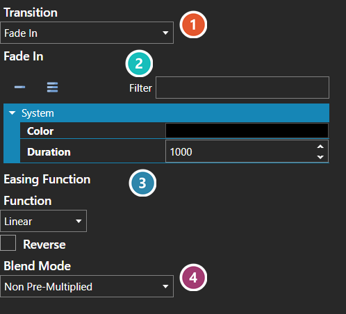

# Transition Editor

*Источник: https://docs.rpg-architect.com/04-editor/transition-editor/*

---

# Transition Editor

## **Transition Editor**[¶](#transition-editor "Permanent link")

The Transition Editor is where the animation between one screen and the next is configured — what the player sees as a scene arrives or leaves.

Transition chooses the effect, and the settings beneath it change to match what that effect needs. Duration sets how long it runs, and the [Easing Function](../easing-function-editor/) shapes how it progresses over that time rather than advancing evenly.

Enter and Exit are configured separately, so a screen can arrive one way and leave another.

The values a transition holds are documented under [Scene Transition](../../05-reference/scene-transition/).

###  Transition[¶](#transition "Permanent link")

Which effect plays. Everything below it follows from this choice.

###  Settings[¶](#settings "Permanent link")

**The settings belong to the chosen transition**, so they are replaced when it changes - a fade asks for a colour and a duration, another effect asks for something else entirely. The full set for each is under [Scene Transition](../../05-reference/scene-transition/).

###  Easing Function[¶](#easing-function "Permanent link")

Shapes how the transition progresses over its duration rather than advancing evenly - see [Easing Function Editor](../easing-function-editor/).

###  Blend Mode[¶](#blend-mode "Permanent link")

How the transition's own drawing is composited over the scene beneath it.