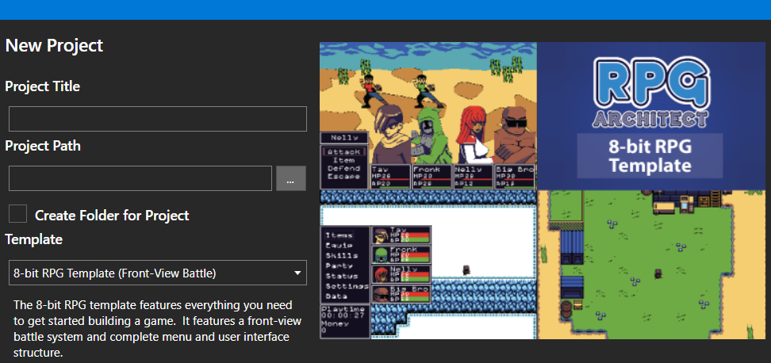
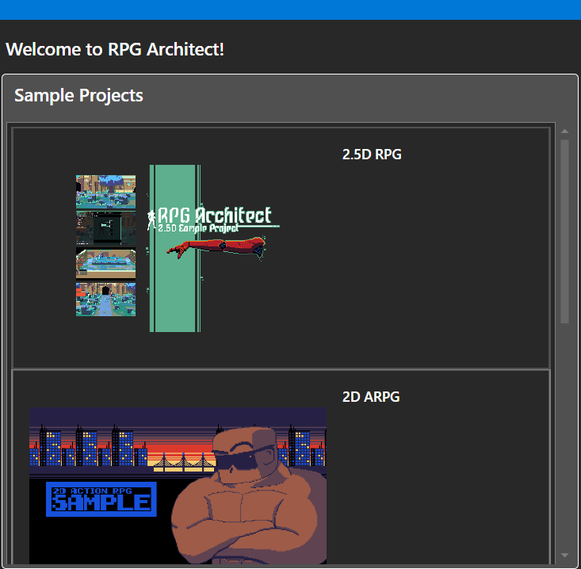

# Getting Started

*Источник: https://docs.rpg-architect.com/02-guides/01-getting-started/*

---

# Getting Started

## **Getting Started**[¶](#getting-started "Permanent link")

If you haven't done so already, RPG Architect can be purchased on Steam at [RPG Architect](https://store.steampowered.com/app/2158670/RPG_Architect/). While you work with RPG Architect, it's important to remember that it is actually an engine and not a game itself. As such, you **will** be required to put in additional effort, but the end result will be a game that matches your vision, rather than being yet another reskin of an already existing game.

If you're looking for a tutorial on a specific topic or how to start using the software, please check out the [Tutorials](../05-tutorials/) section after reading this page.

RPG Architect ships with two useful forms of assets to help you get started: **Templates** and **Samples**.

## **Templates**[¶](#templates "Permanent link")

Templates provide preformatted data and resources, such that you can start building a game immediately. If you were to compare it to building a house, the layout is already built, but you'll need to move your own furniture, paint, and put in some personal touches to make it your own.

> **Note**: Optionally, you can choose to create your game without a template, which is akin to having a section of land with a foundation and building material at the ready. You can build it however you like, but you'll have no structure, walls, or anything else.

## **Samples**[¶](#samples "Permanent link")

Samples are projects that have been already built. Samples are the equivalent of someone else's house or even just a single room.

> **Note**: Samples may only introduce a concept and are not guaranteed to be feature complete in terms of user interfaces, battle systems, and so forth. They are useful as a reference for building or implementing something new.

## **Community**[¶](#community "Permanent link")

One of the most important pieces of RPG Architect is the community. We are **extremely** active in Discord, but we have other methods of contact as well. As such, the following links will be very helpful when trying to connect:

*   **[Discord](https://discord.gg/nKDhjJpC3D)**
*   **[Forum](https://forum.rpg-architect.com/)**
*   **[Project Tracker](https://tracker.rpg-architect.com/)**
*   **[Reddit](https://reddit.com/r/rpgarchitect/)**
*   **[Steam](https://steamcommunity.com/app/2158670)**
*   **[X](https://twitter.com/rpgarchitectoff)**
*   **[YouTube](https://www.youtube.com/@rpgarchitectofficial)**

## **The Import Tool**[¶](#the-import-tool "Permanent link")

In addition, the [RPG Architect Import Tool](https://rpg-architect.com/import-tool/) can be downloaded for free from our website - **OR** - found under the "Tools" section of your Steam Library as an optional download, once you have purchased and downloaded RPG Architect.

The Import Tool helps to import graphic assets designed for other software, like tilesets and sprites and converts them into an RPG Architect compatible format.