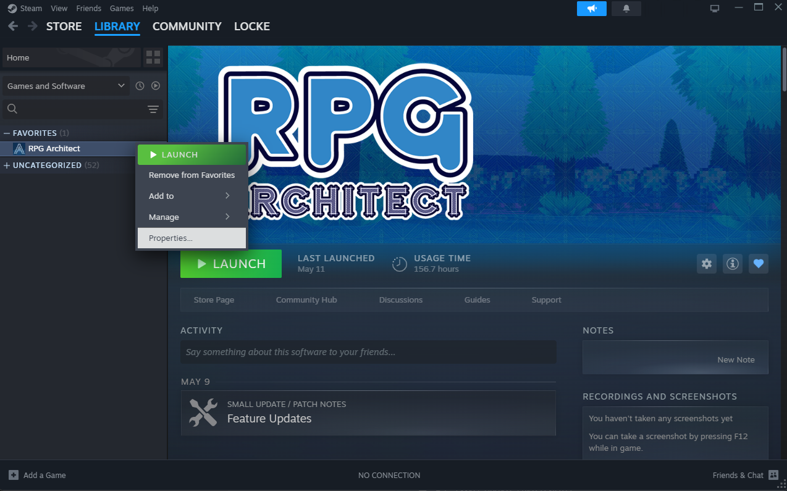
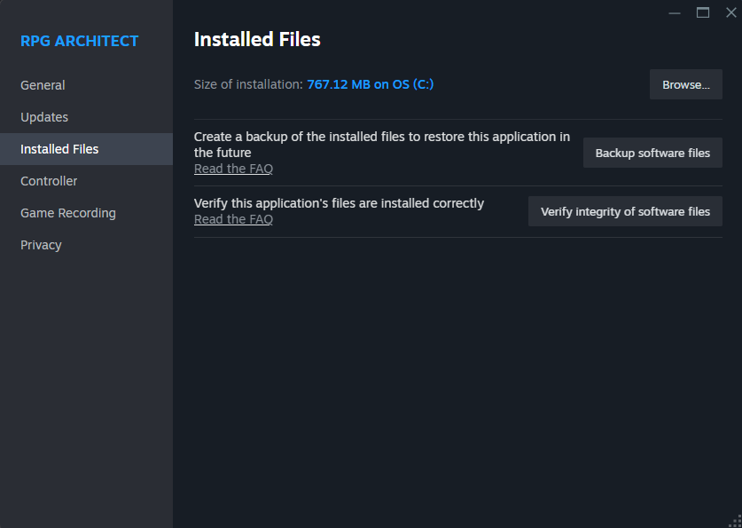
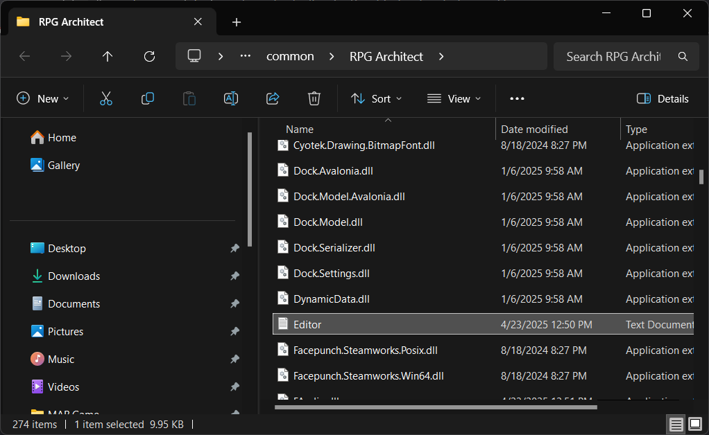
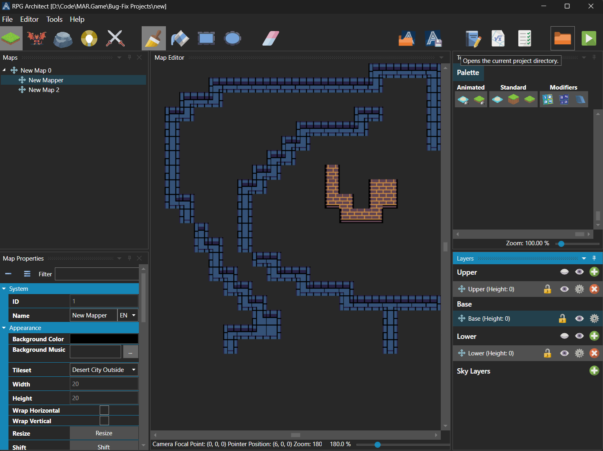
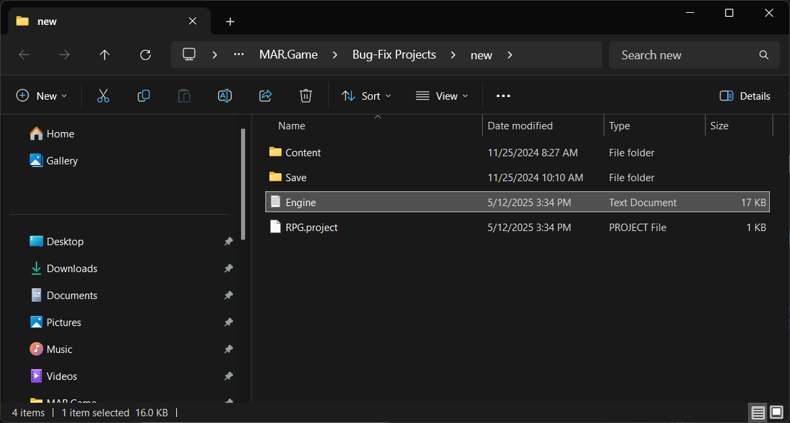
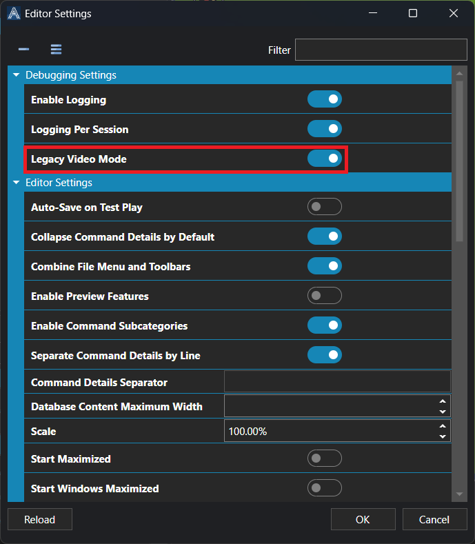

# Troubleshooting

*Источник: https://docs.rpg-architect.com/02-guides/04-troubleshooting/*

---

# Troubleshooting

## **Troubleshooting**[¶](#troubleshooting "Permanent link")

#### **How do I find my Editor logs?**[¶](#how-do-i-find-my-editor-logs "Permanent link")

*   An **Editor.log** will be present in the install directory for RPG Architect. You can find it by browsing to where Steam downloaded and installed RPG Architect to.

Context click on **RPG Architect**, then click **Properties**.

Click **Installed Files**, then click **Browse...**

**Editor.log** will be in this directory.

#### **How do I find my Engine logs?**[¶](#how-do-i-find-my-engine-logs "Permanent link")

An **Engine.log** will be present in the root folder of your game project. It lives in the same directory as the Content folder and your project file.

Click on the **Folder** icon in the RPG Architect toolbar.

**Engine.log** will be in this directory.

#### **RPG Architect's editor will not load my game.**[¶](#rpg-architects-editor-will-not-load-my-game "Permanent link")

Please check for diagnostic errors that are logged to Editor.log in the RPG Architect application directory or your project root directory, alongside the RPG.project file.

#### **RPG Architect will not run my game in test mode.**[¶](#rpg-architect-will-not-run-my-game-in-test-mode "Permanent link")

Please share a zipped copy of your project with support staff on the [Discord #support](https://discord.com/channels/798403733628518451/798404049329717259) channel.

#### **RPG Architect displays a blank screen when I run my game in test mode.**[¶](#rpg-architect-displays-a-blank-screen-when-i-run-my-game-in-test-mode "Permanent link")

By default, RPG Architect will try to render a title screen, even if no title menu has been set. You will need to either:

*   Toggle the **Skip Title** property under [Database \\ System \\ Title](../../06-database/10-system/20-title/).
*   Specify the **Menu** property under [Database \\ System \\ Title](../../06-database/10-system/20-title/).

#### **RPG Architect's test mode opens and then closes.**[¶](#rpg-architects-test-mode-opens-and-then-closes "Permanent link")

This is because RPG Architect uses Vulkan the rendering pipeline now, as the modern default of FNA and SDL. You can enable the legacy mode (Open GL) under **Editor** \\ **Editor Settings** \\ **Edit Settings** under the **Debugging Settings** category with the toggle **Legacy Video Mode**.

