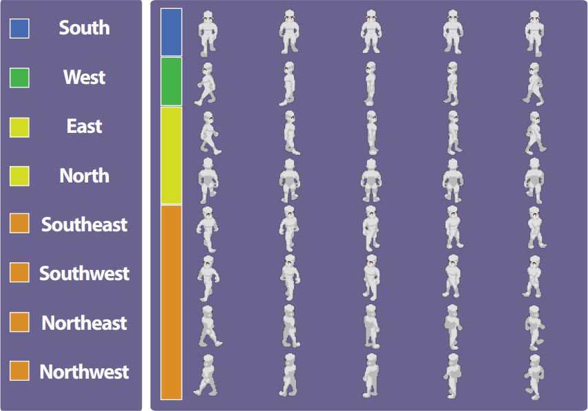

# Sprite Format

*Источник: https://docs.rpg-architect.com/05-reference/sprite-format/*

---

# Sprite Format

## **Sprite Format**[¶](#sprite-format "Permanent link")

RPG Architect uses spritesheet conventions for character animation. Spritesheets lay out animation frames in a grid, with directions arranged horizontally and frames stacked vertically.

### Direction Count[¶](#direction-count "Permanent link")

The engine supports up to 8 directional variations:

*   **1 Direction** — forward-facing only
*   **2 Directions** — horizontal or vertical
*   **4 Directions** — cardinal directions (N, S, E, W)
*   **8 Directions** — extended cardinal directions (N, NE, E, SE, S, SW, W, NW)

### Orientation[¶](#orientation "Permanent link")

Historical game engines used "ping-pong" animation where the middle frame is the idle position. RPG Architect supports this through the **Orient Around Center Frame** property. When disabled, the first frame is treated as the standing or rest frame.

### Frames[¶](#frames "Permanent link")

RPG Architect supports any number of frames per animation — configure this through the **Frame Count** property.

### Dimensions[¶](#dimensions "Permanent link")

There are no fixed dimensional constraints. Use **Frame Width** and **Frame Height** to specify the size of each individual animation frame.