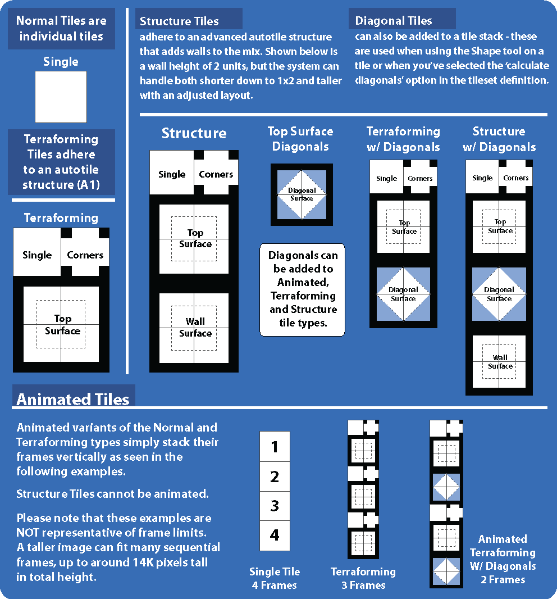

# Tileset Format

*Источник: https://docs.rpg-architect.com/05-reference/tileset-format/*

---

# Tileset Format

## **Tileset Format**[¶](#tileset-format "Permanent link")

Tilesets in RPG Architect function similarly to sprites and can be built from established resources. The fewer textures used, the faster things will run.

Each type except Flat supports up to three associated images. Animated tiles can optionally terraform through configuration, while Terraforming and Structural tilesets always terraform.

### Animated[¶](#animated "Permanent link")

**Size:** 1x1 (non-terraforming) or 2x3 (terraforming)

Animations are organized vertically — the next frame of each tile is placed below the prior. A single tileset supports up to three animated tiles with different frame counts.

Organize all tiles horizontally with frames stacked underneath; avoid adding secondary rows of animated tiles oriented vertically. When terraforming is enabled, each terraforming component is treated as an individual tile.

### Terraforming[¶](#terraforming "Permanent link")

**Size:** 2x3

Automatically draws edges based on adjacent tile placement. The six components are: no edges, corner edges, top-left, top-right, bottom-left, and bottom-right transformations.

### Structural[¶](#structural "Permanent link")

**Size:** 2x4+ (3 vertical tiles for the terraforming top, plus configurable wall height below)

Functions like Terraforming but also automatically sets tile height during 3D map generation and builds walls from the components below the top section. Wall height defaults to two tiles. Supports optional "soft" diagonal edges when enabled in the Tilesets database.

Design from the top down — walls are built automatically.

### Flat[¶](#flat "Permanent link")

**Size:** 1x1

Non-animated, non-terraforming tiles with no special behavior. Unlike other types, flat tilesets support unlimited quantity per tileset rather than being limited to three.